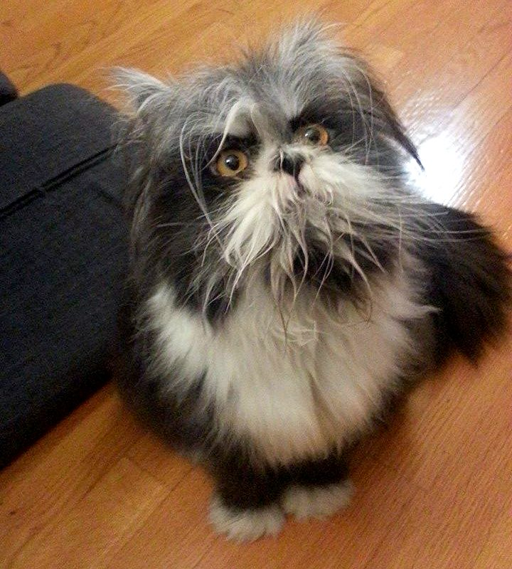
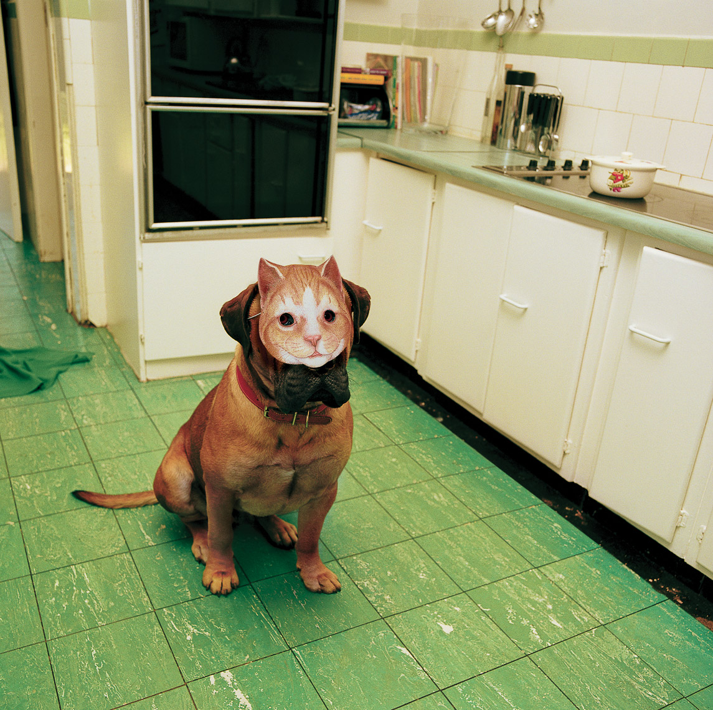

# Training and inference of image recognition model for Cats and Dogs classification task with kotlinDL

## Installation

To use KotlinDL in your project, add the following dependency to your `build.gradle` file:
```
   repositories {
      mavenCentral()
   }
   
   dependencies {
       implementation ("org.jetbrains.kotlinx:kotlin-deeplearning-api:[KOTLINDL-VERSION]")
   }
```
For the reference use [`build.gradle.kts`](./build.gradle.kts) from this repository

## Results
`VGG11` model was trained for 10 epochs on CPU. 
It obtained accuracy on test set equals 0.84.
And 1.0 accuracy on [special images](./cache/datasets/special_images).

## Run

[`train.kt`](src/main/kotlin/train.kt) script is used for training the model and evaluation on test data.

[`inference.kt`](src/main/kotlin/inference.kt) script is used for inference of the pretrained model and evaluation on test data and special images.

## Data

Model was trained with standard dataset `dogsCatsDataset` from [kotlinDL](https://github.com/JetBrains/KotlinDL) framework.

The model was tested with additional data for checking the generalization abilities:

| Cat (looks like dog)  | Dog (with confusing cat mask pattern) |
| --------  | -------- |
| | |

Any other data can be added to [special images](./cache/datasets/special_images) directory (according to class file structure) and test the model.

## Model

VGG11 architecture was used for classification task. Realization was adopted from examples in [kotlinDL repository](https://github.com/JetBrains/KotlinDL/blob/3f10e46c53f12a89783a1d932bcfc39216cf21c6/examples/src/main/kotlin/examples/dataset/VGGCifar10OnFly.kt).
Model can be replaced with `LeNet` architecture. Both architectures are presented [here](src/main/kotlin/model).

